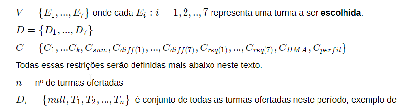
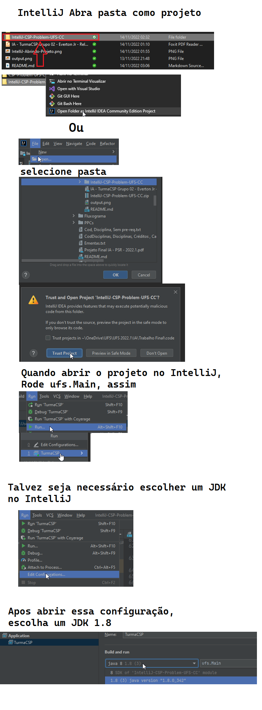

# Projeto
Problema e Solução de um Constraint Satisfaction Problem (**CSP**) direcionado à um estudante de uma universidade que deseja encontrar turmas para o proximo periodo que não haja choque de horário, tenha prerequisitos além de outras **restrições**. 

Definição formal do problema e do projeto encontra-se no arquivo `IA - TurmaCSP Grupo 02 - Everton Jr - Relatorio.pdf`.

Usamos Backtracking Serach para resolver mas busca local entre outros podem ser usados.

Foi usado o código do AIMA https://github.com/aimacode/aima-java e tudo escrito em java.

---

# Como Compilar e Rodar o projeto
## Requisitos
- `python 3`
- `javac` e `java`, versão Java 8.
- `git`

#### **Observação**: Todos os programas acima devem estar configurados no `PATH`

### Ubuntu Linux:

- Atualizar		
		
		$ sudo apt update && sudo apt upgrade

- JDK, python e git
		
		$ sudo apt-get install default-jdk python3 git

### Manjaro Linux (usando pacman):

- Update pacman

		$ sudo pacman -Syu

- JDK pode ser instalado com o comando

		$ sudo pacman -S jre8-openjdk-headless jre8-openjdk jdk8-openjdk openjdk8-doc openjdk8-src

- Python para compilar os arquivos java
		
		$ sudo pacman -S python3
		$ sudo pacman -S git

## Primeiramente
-	Vá diretório que **NÃO possua caracteres especiais** (acentos, emojis, coisas assim) e vá para o diretório clonado chamado `CSP-Problem-UFS-CC` que está todo o projeto. Todos os comandos a seguir em (Opção 1,2,3) devem ser feitos **dentro do diretório onde o código se encontra**.

		$ cd ./CSP-Problem-UFS-CC

## Compilar : Opção 1 - Usar python para *compilar* e *rodar*:
- Rode `./compile.py` que irá compilar e rodar todo o projeto.
			
		$ python3 compile.py

- Se tiver no Windows basta dar double-click em `compile.py`

## Compilar: Opção 2 - Usar um programa java para apenas *compilar*:
- Rode o comando abaixo para compilar um programa em java que é responsável a compilar o projeto:

		$ javac Compile.java

- Agora rode esse programa com o comando abaixo:
		
		$ java Compile
	
- Se tudo deu certo, então o projeto foi compilado, basta agora rodar com o comando abaixo:
	
		$ java -cp "./build/" ufs.Main
		
## Compilar: Opção 3 - Manualmente:
- Rode o comando abaixo para *compilar*:

		$ javac -classpath "./build/" -sourcepath "./" -d "./build/" -encoding UTF-8 @javafiles.args

- Opcionalmente para compilar rode essa versão menor
		
		$ javac -d "./build/" -encoding UTF-8 @javafiles.args 

- Caso tenha ainda tenha problemas com encoding na hora de compilar:
	-	adicione uma variavel de sistema chamada `JAVA_TOOL_OPTIONS`

	- E o valor da variável deve ser `-Dfile.encoding=UTF8`

	Isso garante que pode-se usar caracteres UTF8 no projeto, já que o código do AIMA usa. 

- Rode o comando abaixo para iniciar o programa a partir da classe `Main` do projeto
	
		$ java -cp "./build/" ufs.Main

## Compilar: Opção 4 (Usando IntelliJ):
	
- Agora através do IntelliJ abra o a pasta `IntelliJ-CSP-Problem-UFS-CC` que extraiu como projeto IntelliJ. 

# Observações sobre o projeto
- As disciplinas são geradas de maneira aleatória através de uma dada combinação, por isso pode ser que não seja possível satisfazer todas as restrições do aluno dessa vez.
- Para ser mais ilustrativo, basta rodar o projeto novamente que é bem provável que encontre uma solução que satisfaça todas as restrições.
- output.png possui um printscreen da saida no console do projeto

# Resources 
- Compiling resource
`https://docs.oracle.com/javase/8/docs/technotes/tools/windows/javac.html#BHCGAJDC`